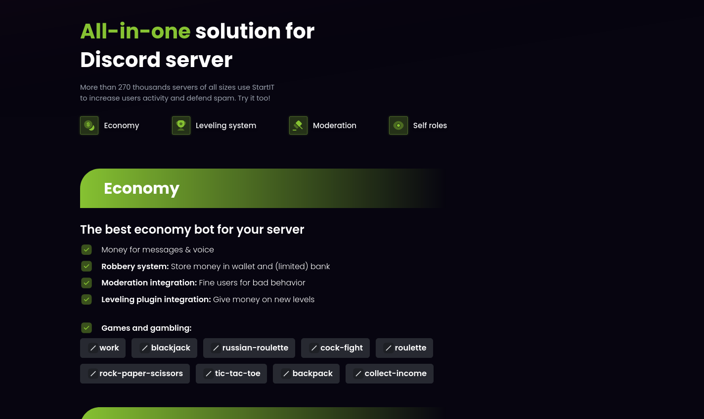

# top.gg showcase

This is source code for the StartIT description on [top.gg](https://top.gg/bot/572906387382861835) website.

## How to use

1. Clone this repository
2. Install dependencies with `npm install`
3. Run `npm run dev` to start development server
4. Push your changes to GitHub

## Contributing

Feel free to contribute to this repo. You can do it by opening an issue or pull request.
